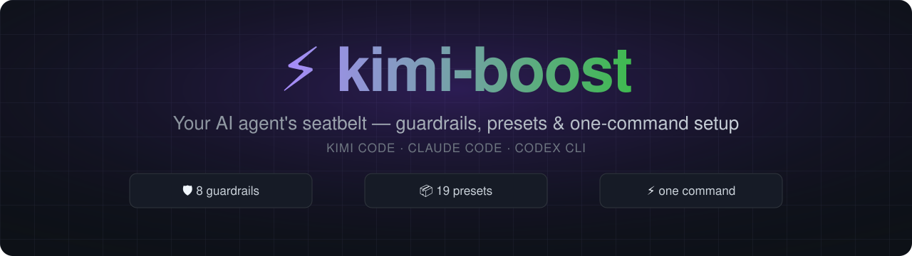
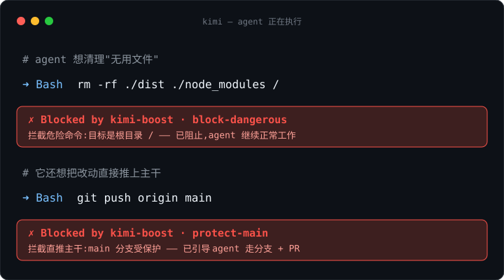
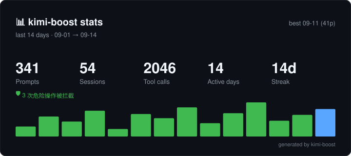
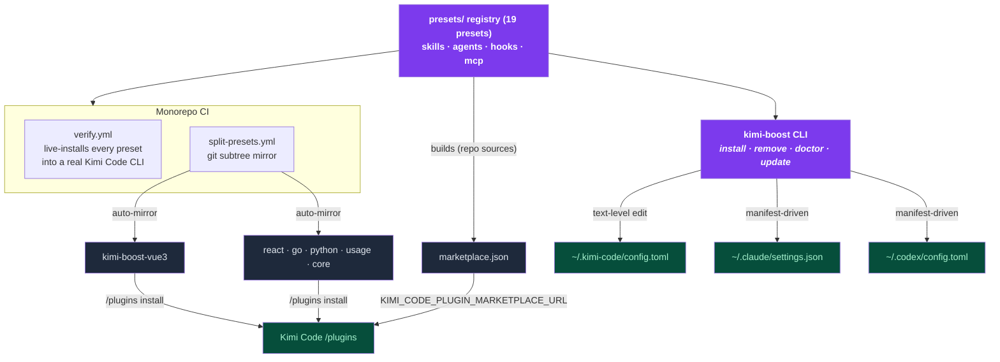

<div align="center">



**`npx kimi-boost init` → 识别你的技术栈 → 装好护栏与规范。**

[](https://github.com/shidesheng0218/kimi-boost)
[](https://www.npmjs.com/package/kimi-boost)
[](/LICENSE)
[](https://github.com/shidesheng0218/kimi-boost/actions/workflows/ci.yml)
[](https://github.com/shidesheng0218/kimi-boost/actions/workflows/verify.yml)
[](#presets)

**[English](README.md) · [中文文档](docs/README.zh-CN.md)**

</div>

---

## ⚡ Why

Your AI coding agent only knows what you teach it. Unguided, it writes generic code, pushes straight to `main`, and runs `rm -rf` without flinching. Hand-configuring skills, hooks and agents takes hours — so nobody does it.

**kimi-boost installs a complete, opinionated workflow in seconds:**

| You get | What it does |
|---|---|
| 🧠 **Skills** | Best-practice rules your agent **auto-loads** — no prompting required |
| 🔍 **Reviewer agents** | Read-only subagents your agent delegates to before committing |
| 🛡️ **Guards** | Cross-platform Node hooks: dangerous commands, trunk protection, secret scanning |
| 🔄 **One-command updates** | `kimi-boost update` keeps every preset current, even on forks |

<div align="center">


</div>

<details>
<summary>GIF won't load (or slow CDN)? Same session as plain text.</summary>

```text
$ kimi-boost install vue3
✓ [kimi] Installed preset 'vue3' into Kimi Code
  /Users/you/.kimi-boost/hooks/vue3
  config.toml[extra_skill_dirs], config.toml[extra_agent_dirs], config.toml[[hooks]] (+1)
  Run /reload or start a new session.

$ kimi-boost doctor
✓ kimi: detected (version 0.36.1)
✓ kimi: config.toml parses
✓ kimi: hook script valid
✓ kimi: mounted dir present
All checks passed.
```

</details>

---

## 🛡️ Guardrails — the seatbelt you can see

Most agent safety is invisible: a hook silently blocks something and you never learn your agent almost ran `rm -rf /`. kimi-boost makes the seatbelt visible.

<div align="center">



</div>

**Eight guards in the `core` preset** (included by default in `kimi-boost init`, or `/plugins install …/kimi-boost-core` with no CLI at all):

| Guard | What it blocks |
|---|---|
| `protect-main` | Direct pushes to `main`/`master` |
| `block-dangerous` | `rm -rf /`, `mkfs`, `dd` to disk, `curl \| sh` |
| `git-destructive` | `reset --hard`, `clean -f`, `checkout -- .` (workspace-wiping) |
| `secret-scan` | Hardcoded secrets in written files (AWS keys, private keys, tokens) |
| `protect-credentials` | Reading `~/.ssh`, `~/.aws/credentials`, `*.pem`… into model context |
| `protect-paths` | Hand-editing lockfiles; writes into `node_modules/`, `dist/`, `.git/` |
| `protect-guards` | The agent disabling guardrails or rewriting their config |
| `secret-scan-post` | A PostToolUse re-scan that catches secrets written via shell redirection |

**Visible, tunable, honest:**

- Every block lands in `~/.kimi-boost/guard-log.jsonl` (previews redacted — never the secret itself). `kimi-boost guard` shows status + block counts; `guard --log` lists recent blocks; `kimi-boost stats` reports **🛡️ N blocks** on your share card.
- Tune live without reinstalling: `guard --disable/--enable <name>` toggles, `--warn/--block <name>` softens to warn-only, `--explain <name>` tells you what it blocks and the risk of disabling it, `--add-pattern <regex>` teaches `block-dangerous` your own patterns.
- **Same guards in CI**: `guard --ci [--staged]` scans changed files for secrets and exits non-zero on findings; `guard --install-git-hook` wires that into a pre-commit hook.

> [!IMPORTANT]
> **What the guardrails don't promise.** Pattern matching is not a security boundary — sandboxing is. These hooks raise the cost of accidents; a determined adversary (or a prompt-injected agent) can obfuscate around them (`base64 | sh`, scripts, runtime-assembled secrets). Everything fails open on purpose: a hook error never blocks your work. `secret-scan-post` informs — the write already happened. Guards are per-tool. Layer them with host-side secret scanning, review, and a sandbox.

---

## 📦 Presets

Each preset is **one directory** — a valid `kimi.plugin.json` plugin AND a kimi-boost preset:

```
presets/<id>/
├── preset.json          # kimi-boost metadata
├── kimi.plugin.json     # Kimi Code plugin manifest (native marketplace form)
├── skills/<name>/SKILL.md
├── agents/<name>-reviewer.md
└── hooks/<name>.mjs     # cross-platform Node, fail-open by design
```

**By stack:**

| Preset | Stack | Reviewer | Guard | Mirror |
|---|---|---|---|---|
| `vue3` | Vue 3 + TypeScript | ✅ | 🛡️ main | [✅](https://github.com/shidesheng0218/kimi-boost-vue3) |
| `react` | React + TypeScript | ✅ | 🛡️ main | [✅](https://github.com/shidesheng0218/kimi-boost-react) |
| `go` | Go | ✅ | 🛡️ main | [✅](https://github.com/shidesheng0218/kimi-boost-go) |
| `python` | Python | ✅ | 🛡️ dangerous shell | [✅](https://github.com/shidesheng0218/kimi-boost-python) |
| `nextjs` | Next.js (fullstack) | ✅ | 🛡️ main | via CLI |
| `react-native` | React Native | ✅ | 🛡️ main | via CLI |
| `flutter` | Flutter / Dart | ✅ | 🛡️ main | via CLI |
| `uniapp` | uni-app (cross-platform) | ✅ | 🛡️ main | via CLI |
| `weapp` | WeChat Mini Program | ✅ | — | via CLI |
| `nestjs` | NestJS backend | ✅ | 🛡️ main | via CLI |
| `express` | Express (Node.js) | ✅ | 🛡️ main | via CLI |
| `fastapi` | FastAPI | ✅ | 🛡️ main | via CLI |
| `rust` | Rust | ✅ | 🛡️ main | via CLI |
| `java` | Java (Spring Boot) | ✅ | 🛡️ main | via CLI |

**Special:**

| Preset | What it gives you | Mirror |
|---|---|---|
| `core` 🛡️ | **The baseline insurance every project should have** — the 8 guardrails above. Default in `init` | [✅](https://github.com/shidesheng0218/kimi-boost-core) |
| `usage` | Sessions / prompts / tool calls tracked into `~/.kimi-boost/usage.json`; daily limit hint via `KIMI_BOOST_DAILY_LIMIT`; view with `kimi-boost stats` | [✅](https://github.com/shidesheng0218/kimi-boost-usage) |
| `security` | Deeper guard pack: scans Write/Edit for secrets, blocks `git push --force`/`--delete` + `security-reviewer` agent | via CLI |
| `git-workflow` | Conventional commits, branch naming & PR discipline (skill) + reviewer agent | via CLI |
| `mcp-tools` | Zero-config MCP servers: `fetch` + `time` | via CLI |

> [!NOTE]
> Every preset bundles a best-practice SKILL.md (auto-loaded) + a reviewer agent. New stacks are vote-driven — [issue #1](https://github.com/shidesheng0218/kimi-boost/issues/1). "via CLI" presets get their own official repo as demand grows.

---

## 🔧 Commands

**Install & manage**

| Command | What it does |
|---|---|
| `init` | Detect this project's stack and install matching presets — always includes the `core` guardrails (`--yes`, `--dry-run`, `--project`) |
| `install [preset]` | Install by id — or from any GitHub repo: `install github:owner/repo` (`--dry-run`, `--with-hooks`, `--project`) |
| `remove <preset>` | Uninstall cleanly |
| `list` | Show available + installed presets |
| `status` | Detect installed CLIs & platform |
| `doctor [--fix]` | Diagnose config, hooks, mounted dirs, manifest consistency, duplicate hooks |

**Guardrails**

| Command | What it does |
|---|---|
| `guard` | Guardrail status + block history |
| `guard --log [-n N]` | Recent blocked actions |
| `guard --disable/--enable <name>` | Turn a guard off/on — live, no reinstall |
| `guard --warn/--block <name>` | Soften to warn-only / restore blocking |
| `guard --explain <name>` | What it blocks, how to bypass, the risk of disabling |
| `guard --add-pattern <regex>` | Teach `block-dangerous` a custom pattern |
| `guard --ci [--staged]` | Scan changed/staged files for secrets; non-zero exit on findings |
| `guard --install-git-hook` | Wire `--ci --staged` into a pre-commit hook (`--uninstall-git-hook` removes it) |

**Updates**

| Command | What it does |
|---|---|
| `update` | Pull latest versions and re-apply (works on forks; community presets update from source repo) |
| `update --dry-run` | Preview the version + file-level diff without writing |
| `update --check` | Check without installing; notifies + exits non-zero if found |
| `update --watch [--interval h] [--uninstall]` | Periodic background check (LaunchAgent/cron/schtasks) |
| `outdated [--project] [--json]` | Installed presets with newer registry versions |

**Stats & sharing**

| Command | What it does |
|---|---|
| `stats [-d N] [--share]` | Usage report with bar chart, streak & top tools; `--share` exports an SVG card (alias: `usage`) |
| `badge [preset]` | Print a README badge (markdown) |
| `export [file]` | Export your preset setup to a shareable file (`--embed-content`, `--include-usage`) |
| `import <file>` | Restore a previously exported setup (`--yes`, `--dry-run`) |

**Authoring & team**

| Command | What it does |
|---|---|
| `create <id>` | Scaffold a new preset under `presets/` (`--shape skill\|mcp\|command`) |
| `validate <dir>` | Validate a preset directory |
| `dev <dir>` | Validate + preview-install a local preset (dry-run) |
| `package <dir>` | Validate + pack a preset into `<id>-<version>.zip` |
| `marketplace` | Generate a Kimi Code custom marketplace JSON |
| `bootstrap [--makefile]` | Generate a `setup.sh` / Makefile target for team onboarding |

---

## 🌐 Install channels

**① Official Kimi Code plugin channel — no CLI required.** Flagship presets are mirrored to single-plugin repos:

```
/plugins install https://github.com/shidesheng0218/kimi-boost-vue3
```

Mirrors: [vue3](https://github.com/shidesheng0218/kimi-boost-vue3) · [react](https://github.com/shidesheng0218/kimi-boost-react) · [go](https://github.com/shidesheng0218/kimi-boost-go) · [python](https://github.com/shidesheng0218/kimi-boost-python) · [usage](https://github.com/shidesheng0218/kimi-boost-usage) · **[core](https://github.com/shidesheng0218/kimi-boost-core)** — the guardrails, installable in Kimi Code with no CLI at all.

Or browse them in the `/plugins` panel via our marketplace feed:

```bash
export KIMI_CODE_PLUGIN_MARKETPLACE_URL=https://raw.githubusercontent.com/shidesheng0218/kimi-boost/main/marketplace.json
```

**② kimi-boost CLI — all 19 presets, three harnesses** (Kimi Code, Claude Code, Codex CLI), with updates, doctor checks and clean uninstalls:

```bash
npx kimi-boost install
```

| | Official channel | kimi-boost CLI |
|---|---|---|
| Presets | 6 flagship (mirrored) | All 19 |
| Harnesses | Kimi Code | Kimi Code · Claude Code · Codex |
| Needs | Just Kimi Code | Node.js |
| Extras | — | update · doctor · stats · dry-run |

**③ Community presets** — anyone can publish a preset as a plain GitHub repo (`preset.json` at the root):

```bash
kimi-boost install github:owner/repo          # or the full URL
kimi-boost install github:owner/repo@v1.2.0   # pin a branch or tag
```

kimi-boost shows exactly what the preset registers (especially its hooks, which execute when the agent runs) and asks before installing. Community presets are tracked in `update` / `outdated` against their source repo. **Only install presets from authors you trust** — hooks run shell commands with your agent's permissions.

---

## 📊 Shareable stats — your AI-coding wrapped

The `usage` preset quietly counts your sessions / prompts / tool calls. `stats` turns it into a report worth screenshotting:

```bash
$ kimi-boost stats -d 7
📊 kimi-boost stats · last 7 days
  128 prompts  ·  12 sessions  ·  856 tool calls  ·  5 active days  ·  streak 3 🔥

$ kimi-boost stats --share   # → kimi-boost-stats.svg
```

`--share` exports a self-contained SVG card (no server, no upload — your data never leaves your machine):

<div align="center">



</div>

---

## 📤 More

- **Project-level installs (team sharing)** — `install <preset> --project` writes skills/agents into `.agents/` + `.claude/` inside your repo, commit it, and every clone gets the same AI behavior.
- **Export & import** — `kimi-boost export` captures presets + versions + community sources + the update watch into one shareable file; `import` restores it on another machine. Dotfiles-friendly.
- **Authoring presets** — `validate` / `dev` / `package` cover the loop; push the directory to GitHub and anyone can `install github:you/my-preset`.
- **doctor** — `kimi-boost doctor` diagnoses config, hooks, mounted dirs and manifest consistency; `--fix` restores what's missing.

---

## 🏗️ How it works



- **Single source of truth** — presets live in this monorepo; the six flagship mirrors are read-only CI artifacts, re-synced on every push.
- **Kimi Code** — the CLI edits `~/.kimi-code/config.toml` at **text level** (a managed `# >>> kimi-boost managed >>>` block plus in-place array merge). Your comments and formatting survive untouched.
- **Claude Code & Codex** — manifest-driven install into `~/.claude` / `~/.codex`; agent files use the native frontmatter format.
- **Hooks are plain Node `.mjs`** — identical behavior on macOS / Windows / Linux.
- **Compatibility is tested, not assumed** — CI live-installs all 19 presets into a real Kimi Code CLI on every PR, and weekly against upstream drift.

## 🛡️ Safety by default

- 🔒 **Never touches your config beyond its own managed section** — comments, ordering, formatting all preserved
- 🗄️ Backed up to `<config>.kboost.bak` before every change
- 🚧 Managed-roots whitelist — refuses to delete anything outside `~/.kimi-boost`, `~/.kimi-code`, `~/.claude`, `~/.codex`
- 🛡️ Dual-channel guard — already installed via Kimi `/plugins`? No duplicate hooks.
- ♻️ **Content-aware hook dedup** — presets bundling the same guard script share a single config entry; uninstalling one preset retargets the entry to the next owner. `doctor` flags redundant or diverging copies.
- ⚡ Fail-open hooks — a crashing hook never blocks your work (exit `0` allow · exit `2` block)

---

## 🗺️ Roadmap

- [x] MCP server presets
- [x] Token/cost usage guard hooks
- [x] Official-channel distribution (single-plugin repo mirrors)
- [x] Per-project (`.kimi-boost/`) presets
- [ ] More stack presets (vote in [issue #1](https://github.com/shidesheng0218/kimi-boost/issues/1))
- [ ] Mirror every preset to its own official repo

## Contributing

The preset catalog is PR-driven: add a directory under `presets/`, CI validates schema, hook events and file existence — then live-installs your preset into a real Kimi Code CLI. See [CONTRIBUTING.md](CONTRIBUTING.md).

---

<div align="center">

MIT · built with ⚡ by [kimi-boost contributors](https://github.com/shidesheng0218/kimi-boost)

</div>
