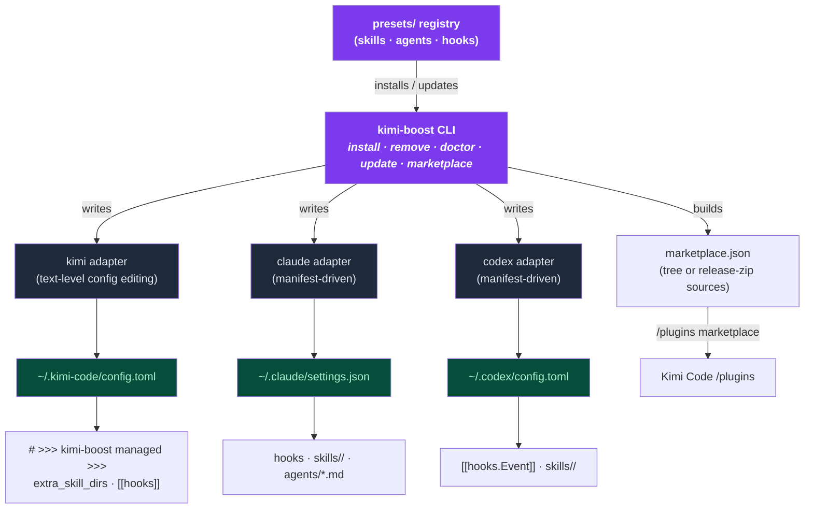

<div align="center">

# ⚡ kimi-boost

**Battle-tested **skills · hooks · agents**, one command — for Kimi Code, Claude Code and Codex CLI.**

`npx kimi-boost install` → pick a preset → done.

[](https://github.com/shidesheng0218/kimi-boost)
[](https://www.npmjs.com/package/kimi-boost)
[](/LICENSE)
[](https://github.com/shidesheng0218/kimi-boost/actions)

</div>

---

## Why

Your AI coding agent only knows what you teach it. Without guidance it writes generic, unidiomatic code, pushes straight to `main`, and runs `rm -rf` on things you liked. Hand-configuring skills, hooks and agents takes hours — so nobody ever does it.

**kimi-boost installs a complete, opinionated development workflow in seconds:**

| You get | What it does |
|---|---|
| 🧠 **Skills** | Best-practice rules your agent **auto-loads** — no prompting required |
| 🔍 **Reviewer agents** | Read-only subagents your agent delegates to before committing |
| 🛡️ **Hooks** | Cross-platform Node guards: dangerous commands, main-branch protection |
| 🔄 **One-command updates** | `kimi-boost update` keeps every preset current, even on forks |

## Demo

<div align="center">


</div>

GIF won't load (or you're behind a slow CDN)? Same session, as plain text:

```text
$ kimi-boost install
✔ Choose a preset:
    python — Python engineering
  > vue3 — Vue 3 + TypeScript
    weapp — WeChat Mini Program

✓ [kimi] Installed preset 'vue3' into Kimi Code
  /Users/you/.kimi-boost/hooks/vue3
  config.toml[extra_skill_dirs], config.toml[extra_agent_dirs], config.toml[[hooks]] (+1)
  Run /reload or start a new session.

$ kimi-boost doctor
✓ kimi: detected (version 0.36.1)
✓ kimi: config.toml parses
✓ kimi: hook script valid
✓ kimi: mounted dir present
All checks passed.
```

## Quick start

```bash
npx kimi-boost install
# ✔ vue3 — Vue 3 + TypeScript
# ✔ weapp — WeChat Mini Program
# ✔ python — Python engineering
```

Interactive picker. Done. Your next session is boosted.

> Requires [Kimi Code](https://www.kimi.com/code/docs/kimi-code-cli/guides/getting-started.html), Claude Code or Codex CLI. Works on macOS, Windows and Linux.

## Presets

| Preset | Stack | Reviewer agent | Hooks |
|---|---|---|---|
| `vue3` | Vue 3 + TypeScript | `vue3-reviewer` | 🛡️ main-branch guard |
| `react` | React + TypeScript | `react-reviewer` | 🛡️ main-branch guard |
| `nextjs` | Next.js (fullstack) | `nextjs-reviewer` | 🛡️ main-branch guard |
| `react-native` | React Native | `react-native-reviewer` | 🛡️ main-branch guard |
| `flutter` | Flutter / Dart | `flutter-reviewer` | 🛡️ main-branch guard |
| `uniapp` | uni-app (cross-platform) | `uniapp-reviewer` | 🛡️ main-branch guard |
| `weapp` | WeChat Mini Program | `weapp-reviewer` | — |
| `nestjs` | NestJS / TypeScript backend | `nestjs-reviewer` | 🛡️ main-branch guard |
| `express` | Express (Node.js) | `express-reviewer` | 🛡️ main-branch guard |
| `fastapi` | FastAPI (Python) | `fastapi-reviewer` | 🛡️ main-branch guard |
| `go` | Go | `go-reviewer` | 🛡️ main-branch guard |
| `rust` | Rust | `rust-reviewer` | 🛡️ main-branch guard |
| `java` | Java (Spring Boot) | `java-reviewer` | 🛡️ main-branch guard |
| `python` | Python | `python-reviewer` | 🛡️ dangerous-shell blocker |

**Special presets:**

| Preset | What it gives you |
|---|---|
| `usage` | Tracks sessions / prompts / tool calls into `~/.kimi-boost/usage.json`; daily limit hint via `KIMI_BOOST_DAILY_LIMIT`; view with `kimi-boost usage` |
| `mcp-tools` | Zero-config MCP servers: `fetch` (web scraping) + `time` (timezones) — written to `~/.kimi-code/mcp.json` |

> Every preset bundles a best-practice SKILL.md (auto-loaded) + a reviewer agent. New stacks are vote-driven — [issue #1](https://github.com/shidesheng0218/kimi-boost/issues/1).

Each preset is **one directory** in this repo — a valid `kimi.plugin.json` plugin AND a kimi-boost preset. Contributions welcome:

```
presets/<id>/
├── preset.json          # kimi-boost metadata
├── kimi.plugin.json     # Kimi Code plugin manifest (native marketplace form)
├── skills/<name>/SKILL.md
├── agents/<name>-reviewer.md
└── hooks/<name>.mjs     # cross-platform Node, fail-open by design
```

## Commands

| Command | What it does |
|---|---|
| `kimi-boost install [preset]` | Install a preset (`--dry-run` preview, `--with-hooks` force) |
| `kimi-boost list` | Show available + installed presets |
| `kimi-boost remove <preset>` | Uninstall cleanly |
| `kimi-boost update [--repo owner/repo]` | Pull latest versions and re-apply (works on forks) |
| `kimi-boost doctor [--fix]` | Diagnose config, hooks, mounted dirs, manifest consistency |
| `kimi-boost marketplace [--source-mode tree\|zip] [--tag vX.Y.Z]` | Generate a Kimi Code custom marketplace JSON |
| `kimi-boost usage [-d N]` | Show session/prompt/tool-call usage tracked by the `usage` preset |
| `kimi-boost status` | Detect installed CLIs & platform |

### `doctor` — know your setup is healthy

```bash
$ kimi-boost doctor
✓ kimi: detected
  version 0.36.1
✓ kimi: config.toml parses
✓ kimi: hook script valid
  /Users/you/.kimi-boost/hooks/vue3/protect-main.mjs
✓ kimi: mounted dir present
⚠ codex: CLI not detected
  Install codex or ignore if you don't use it.

1 warning(s), no errors
```

`kimi-boost doctor --fix` restores missing mounted dirs and hook scripts automatically.

## Also a plugin marketplace

Kimi Code ships a native plugin system (`/plugins`). kimi-boost doubles as a **third-party marketplace** for it:

```bash
kimi-boost marketplace
# 1. Terminal: /plugins marketplace https://raw.githubusercontent.com/shidesheng0218/kimi-boost/main/marketplace.json
# 2. Env var:  export KIMI_CODE_PLUGIN_MARKETPLACE_URL=<same url>
```

Each preset is also installable with `/plugins install` directly, with skills, agents, hooks and MCP servers declared in its manifest.

## How it works



- **Kimi Code** — edits `~/.kimi-code/config.toml` at **text level** (a managed `# >>> kimi-boost managed >>>` block plus in-place array merge). Your comments and formatting survive untouched.
- **Claude Code & Codex** — manifest-driven install into `~/.claude` / `~/.codex`; agent files use the native frontmatter format (cross-compatible, per Kimi docs).
- **Hooks are plain Node `.mjs`** — the same pattern Kimi Code's own docs use, identical behavior on macOS / Windows / Linux.

## Safety by default

- 🔒 **Never touches your config beyond its own managed section** — comments, ordering, formatting all preserved
- 🗄️ Backed up to `<config>.kboost.bak` before every change
- 🚧 Managed-roots whitelist — refuses to delete anything outside `~/.kimi-boost`, `~/.kimi-code`, `~/.claude`, `~/.codex`
- 🛡️ Dual-channel guard — already installed via Kimi `/plugins`? No duplicate hooks.
- ⚡ Fail-open hooks — a crashing hook never blocks your work (exit `0` allow · exit `2` block)

## Roadmap

- [ ] MCP server presets
- [ ] Token/cost usage guard hooks
- [ ] Per-project (`.kimi-boost/`) presets
- [ ] More stack presets (vote in [issue #1](https://github.com/shidesheng0218/kimi-boost/issues/1))

## Contributing

Preset catalog is PR-driven: add a directory under `presets/`, CI validates schema, hook events and file existence. See [CONTRIBUTING.md](CONTRIBUTING.md).

## License

MIT
