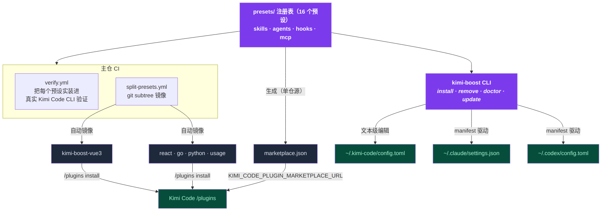

<div align="center">

# ⚡ kimi-boost

**久经实战的 skills · hooks · agents，一条命令装进 Kimi Code、Claude Code 和 Codex CLI。**

`npx kimi-boost install` → 选一个预设 → 完成。

[](https://github.com/shidesheng0218/kimi-boost)
[](https://www.npmjs.com/package/kimi-boost)
[](/LICENSE)
[](https://github.com/shidesheng0218/kimi-boost/actions/workflows/ci.yml)
[](https://github.com/shidesheng0218/kimi-boost/actions/workflows/verify.yml)
[](#预设目录)

**[English](../README.md) · 中文文档**

</div>

---

## 为什么需要它

AI 编程助手只会做你教它的事。不加以引导，它会写出泛泛的代码、直接推 main 分支、对你还想保留的文件执行 `rm -rf`。手动配置 skills / hooks / agents 要花几个小时——大多数人永远不会去做。

**kimi-boost 几秒钟内把完整、有主张的开发工作流装进你的助手：**

| 你能得到 | 作用 |
|---|---|
| 🧠 **Skills** | 助手**自动加载**的最佳实践规则——无需每次提醒 |
| 🔍 **审查 Agent** | 提交前可以委派的只读 subagent |
| 🛡️ **Hooks** | 跨平台 Node 守卫：危险命令拦截、main 分支保护 |
| 🔄 **一键更新** | `kimi-boost update` 保持所有预设最新，支持 fork |

## 演示

<div align="center">


</div>

GIF 加载失败？同一段会话的纯文本版：

```text
$ kimi-boost install vue3
✓ [kimi] Installed preset 'vue3' into Kimi Code
  /Users/you/.kimi-boost/hooks/vue3
  config.toml[extra_skill_dirs], config.toml[extra_agent_dirs], config.toml[[hooks]] (+1)
  Run /reload or start a new session.

$ kimi-boost doctor
✓ kimi: detected (version 0.36.1)
✓ kimi: config.toml parses
✓ kimi: hook script valid
✓ kimi: mounted dir present
All checks passed.
```

## 两种安装方式

**① 官方插件渠道——无需安装任何 CLI。** 五个旗舰预设已镜像为独立插件仓库，在 Kimi Code TUI 里直接装：

```
/plugins install https://github.com/shidesheng0218/kimi-boost-vue3
```

现有镜像：[vue3](https://github.com/shidesheng0218/kimi-boost-vue3) · [react](https://github.com/shidesheng0218/kimi-boost-react) · [go](https://github.com/shidesheng0218/kimi-boost-go) · [python](https://github.com/shidesheng0218/kimi-boost-python) · [usage](https://github.com/shidesheng0218/kimi-boost-usage)

也可以接入我们的市场源，在 `/plugins` 面板里浏览安装：

```bash
export KIMI_CODE_PLUGIN_MARKETPLACE_URL=https://raw.githubusercontent.com/shidesheng0218/kimi-boost/main/marketplace.json
```

**② kimi-boost CLI——全部 16 个预设，三个平台。** 一个安装器同时支持 Kimi Code、Claude Code 和 Codex CLI，带更新、体检和干净卸载：

```bash
npx kimi-boost install
```

| | 官方渠道 | kimi-boost CLI |
|---|---|---|
| 预设数量 | 5 个旗舰（镜像仓） | 全部 16 个 |
| 支持平台 | Kimi Code | Kimi Code · Claude Code · Codex |
| 前置要求 | 只要 Kimi Code | Node.js |
| 额外能力 | — | 更新 · doctor 体检 · 用量统计 · dry-run 预览 |

## 预设目录

| 预设 | 技术栈 | 审查 Agent | Hooks | 官方插件仓 |
|---|---|---|---|---|
| `vue3` | Vue 3 + TypeScript | `vue3-reviewer` | 🛡️ main 分支保护 | [✅ kimi-boost-vue3](https://github.com/shidesheng0218/kimi-boost-vue3) |
| `react` | React + TypeScript | `react-reviewer` | 🛡️ main 分支保护 | [✅ kimi-boost-react](https://github.com/shidesheng0218/kimi-boost-react) |
| `go` | Go | `go-reviewer` | 🛡️ main 分支保护 | [✅ kimi-boost-go](https://github.com/shidesheng0218/kimi-boost-go) |
| `python` | Python | `python-reviewer` | 🛡️ 危险命令拦截 | [✅ kimi-boost-python](https://github.com/shidesheng0218/kimi-boost-python) |
| `nextjs` | Next.js（全栈） | `nextjs-reviewer` | 🛡️ main 分支保护 | 经 CLI 安装 |
| `react-native` | React Native | `react-native-reviewer` | 🛡️ main 分支保护 | 经 CLI 安装 |
| `flutter` | Flutter / Dart | `flutter-reviewer` | 🛡️ main 分支保护 | 经 CLI 安装 |
| `uniapp` | uni-app（跨端） | `uniapp-reviewer` | 🛡️ main 分支保护 | 经 CLI 安装 |
| `weapp` | 微信小程序 | `weapp-reviewer` | — | 经 CLI 安装 |
| `nestjs` | NestJS / TypeScript 后端 | `nestjs-reviewer` | 🛡️ main 分支保护 | 经 CLI 安装 |
| `express` | Express（Node.js） | `express-reviewer` | 🛡️ main 分支保护 | 经 CLI 安装 |
| `fastapi` | FastAPI（Python） | `fastapi-reviewer` | 🛡️ main 分支保护 | 经 CLI 安装 |
| `rust` | Rust | `rust-reviewer` | 🛡️ main 分支保护 | 经 CLI 安装 |
| `java` | Java（Spring Boot） | `java-reviewer` | 🛡️ main 分支保护 | 经 CLI 安装 |

**特殊预设：**

| 预设 | 能力 | 官方插件仓 |
|---|---|---|
| `usage` | 会话/提示/工具调用统计到 `~/.kimi-boost/usage.json`；`KIMI_BOOST_DAILY_LIMIT` 每日阈值提醒；`kimi-boost usage` 查看 | [✅ kimi-boost-usage](https://github.com/shidesheng0218/kimi-boost-usage) |
| `mcp-tools` | 零配置 MCP servers：`fetch`（网页抓取）+ `time`（时区）——写入 `~/.kimi-code/mcp.json` | 经 CLI 安装 |

> 每个预设都内置一份最佳实践 SKILL.md（自动加载）+ 一个审查 Agent。新技术栈由投票驱动——[issue #1](https://github.com/shidesheng0218/kimi-boost/issues/1)。"经 CLI 安装"的预设会随需求增长陆续镜像为官方插件仓。

每个预设就是本仓库里的**一个目录**——既是合法的 `kimi.plugin.json` 插件，也是 kimi-boost 预设。欢迎贡献：

```
presets/<id>/
├── preset.json          # kimi-boost 元数据
├── kimi.plugin.json     # Kimi Code 插件 manifest（官方市场格式）
├── skills/<name>/SKILL.md
├── agents/<name>-reviewer.md
└── hooks/<name>.mjs     # 跨平台 Node，fail-open 设计
```

## 命令

| 命令 | 作用 |
|---|---|
| `kimi-boost install [预设]` | 安装预设（`--dry-run` 预览，`--with-hooks` 强制含 hooks，`--project` 装进当前项目） |
| `kimi-boost list` | 查看可用与已安装预设 |
| `kimi-boost remove <预设>` | 干净卸载 |
| `kimi-boost update [--repo owner/repo]` | 拉取最新版本并重新应用（支持 fork） |
| `kimi-boost outdated [--project] [--json]` | 查看已安装预设中有新版本的清单 |
| `kimi-boost doctor [--fix]` | 诊断配置、hooks、挂载目录、manifest 一致性、重复 hook |
| `kimi-boost marketplace [--source-mode repo\|zip]` | 生成 Kimi Code 自定义市场 JSON |
| `kimi-boost usage [-d N]` | 查看 usage 预设记录的会话/提示/工具调用量 |
| `kimi-boost status` | 检测已安装的 CLI 与平台 |

### 项目级安装（团队共享）

`kimi-boost install <预设> --project` 把预设写进当前项目而不是你的用户配置：

- skills → `.agents/skills/`（Kimi Code 及兼容 `.agents/` 约定的工具）和 `.claude/skills/`
- agents → `.agents/agents/` 和 `.claude/agents/`
- hooks → `.claude/settings.json`（仅 Claude Code——Kimi Code 暂无项目级 hook 机制；Codex 跳过）

所有产物都落在项目根（最近的 `.git` 上级目录）内，因此可以**提交进 git 与团队共享**——每个 clone 都获得一致的 AI 行为。卸载用 `kimi-boost remove <预设> --project`。

### `doctor`——随时确认环境健康

```bash
$ kimi-boost doctor
✓ kimi: detected
  version 0.36.1
✓ kimi: config.toml parses
✓ kimi: hook script valid
  /Users/you/.kimi-boost/hooks/vue3/protect-main.mjs
✓ kimi: mounted dir present
⚠ codex: CLI not detected
  Install codex or ignore if you don't use it.

1 warning(s), no errors
```

`kimi-boost doctor --fix` 会自动修复缺失的挂载目录和 hook 脚本。

## 工作原理



- **唯一事实来源**——预设只在主仓维护；五个旗舰镜像仓是 CI 自动同步的只读产物，每次推送自动更新。
- **Kimi Code**——CLI 以**文本级**方式编辑 `~/.kimi-code/config.toml`（一个 `# >>> kimi-boost managed >>>` 受管区块 + 原位数组合并），你的注释和格式原样保留。
- **Claude Code 与 Codex**——以 manifest 驱动方式装入 `~/.claude` / `~/.codex`；Agent 文件采用原生 frontmatter 格式（按 Kimi 官方文档跨平台兼容）。
- **Hooks 就是普通 Node `.mjs`**——与 Kimi Code 官方文档同款写法，macOS / Windows / Linux 行为一致。
- **兼容性是测出来的，不是猜的**——CI 会在每个 PR 上把 16 个预设实装进真实的 Kimi Code CLI，并每周跑一次以捕捉上游变化。

## 默认安全

- 🔒 **绝不碰受管区块以外的配置**——注释、顺序、格式全部保留
- 🗄️ 每次修改前备份到 `<config>.kboost.bak`
- 🚧 受管目录白名单——拒绝删除 `~/.kimi-boost`、`~/.kimi-code`、`~/.claude`、`~/.codex` 之外的任何内容
- 🛡️ 双渠道防重——已经通过 Kimi `/plugins` 装过？不会重复注册 hook
- ♻️ **按内容去重 hook**——多个预设携带相同守卫脚本（如 `protect-main.mjs`）时只注册一条共享条目；卸载其中一个预设会自动把条目重定向到下一个共享者，其余预设不受影响。`doctor` 会标记冗余或内容分叉的 hook 副本
- ⚡ Hooks fail-open——hook 崩溃也不会阻塞你的工作（退出码 `0` 放行 · `2` 拦截）

## 路线图

- [x] MCP server 预设
- [x] Token/成本用量守卫 hooks
- [x] 官方渠道分发（单插件镜像仓）
- [x] 项目级（`.kimi-boost/`）预设
- [ ] 更多技术栈预设（[issue #1](https://github.com/shidesheng0218/kimi-boost/issues/1) 投票）
- [ ] 全部预设镜像为官方插件仓

## 参与贡献

预设目录由 PR 驱动：在 `presets/` 下新增一个目录即可，CI 会校验 schema、hook 事件和文件存在性，并把你的预设实装进真实的 Kimi Code CLI 验证。详见 [CONTRIBUTING.md](../CONTRIBUTING.md)。

## 许可证

MIT
