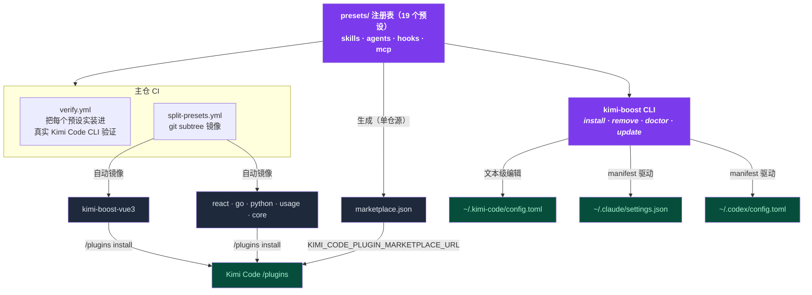

<div align="center">


**`npx kimi-boost init` → 识别你的技术栈 → 装好护栏与规范。**

[](https://github.com/shidesheng0218/kimi-boost)
[](https://www.npmjs.com/package/kimi-boost)
[](/LICENSE)
[](https://github.com/shidesheng0218/kimi-boost/actions/workflows/ci.yml)
[](https://github.com/shidesheng0218/kimi-boost/actions/workflows/verify.yml)
[](#预设目录)

**[English](../README.md) · 中文文档**

</div>

---

## ⚡ 为什么需要它

AI 编程助手只会做你教它的事。不加以引导，它会写出泛泛的代码、直接推 main 分支、对你还想保留的文件执行 `rm -rf`。手动配置 skills / hooks / agents 要花几个小时——大多数人永远不会去做。

**kimi-boost 几秒钟把完整、有主张的开发工作流装进你的助手：**

| 你能得到 | 作用 |
|---|---|
| 🧠 **Skills** | 助手**自动加载**的最佳实践规则——无需每次提醒 |
| 🔍 **审查 Agent** | 提交前可以委派的只读 subagent |
| 🛡️ **守卫** | 跨平台 Node 护栏：危险命令拦截、主干保护、密钥扫描 |
| 🔄 **一键更新** | `kimi-boost update` 保持所有预设最新，支持 fork |

<div align="center">


</div>

<details>
<summary>GIF 加载失败？同一段会话的纯文本版。</summary>

```text
$ kimi-boost install vue3
✓ [kimi] Installed preset 'vue3' into Kimi Code
  /Users/you/.kimi-boost/hooks/vue3
  config.toml[extra_skill_dirs], config.toml[extra_agent_dirs], config.toml[[hooks]] (+1)
  Run /reload or start a new session.

$ kimi-boost doctor
✓ kimi: detected (version 0.36.1)
✓ kimi: config.toml parses
✓ kimi: hook script valid
✓ kimi: mounted dir present
All checks passed.
```

</details>

---

## 🛡️ 护栏——看得见的安全带

大多数"agent 安全"是隐形的：hook 默默拦了某个操作，你永远不知道 agent 差点跑了 `rm -rf /`。kimi-boost 让这条安全带可见。

<div align="center">


</div>

**`core` preset 内置 8 个守卫**（`kimi-boost init` 默认附带；也可以 `/plugins install …/kimi-boost-core` 零 CLI 安装）：

| 守卫 | 拦截什么 |
|---|---|
| `protect-main` | 直推 `main`/`master` 分支 |
| `block-dangerous` | `rm -rf /`、`mkfs`、`dd` 写盘、`curl \| sh` |
| `git-destructive` | `reset --hard`、`clean -f`、`checkout -- .`（丢工作区） |
| `secret-scan` | 把硬编码密钥（AWS key、私钥、token）写进文件 |
| `protect-credentials` | 把 `~/.ssh`、`~/.aws/credentials`、`*.pem` 读进模型上下文 |
| `protect-paths` | 手改 lockfile；写 `node_modules/`、`dist/`、`.git/` |
| `protect-guards` | agent 自行关闭护栏或改写护栏配置 |
| `secret-scan-post` | PostToolUse 补扫，捕获经 shell 重定向写入的密钥 |

**可见、可调、诚实：**

- 每次拦截都记入 `~/.kimi-boost/guard-log.jsonl`（摘要脱敏，绝不记录密钥本身）。`kimi-boost guard` 看状态与拦截次数；`guard --log` 看明细；`kimi-boost stats` 的分享卡片会显示 **🛡️ N 次拦截**。
- 不重装即可调整：`--disable/--enable <名称>` 开关守卫，`--warn/--block <名称>` 软化为只记录不阻断或恢复硬拦，`--explain <名称>` 说明拦什么/如何放行/关掉的风险，`--add-pattern <正则>` 给 `block-dangerous` 加自定义模式。
- **同一套守卫，进 CI**：`guard --ci [--staged]` 扫描变更文件里的密钥并以非零码退出；`guard --install-git-hook` 把它接进 pre-commit。

> [!IMPORTANT]
> **护栏不承诺什么。** 模式匹配不是安全边界——沙箱才是。这些 hook 抬高的是"事故成本"，挡不住有心规避的对手（或被提示注入的 agent）：`base64 | sh`、脚本包装、运行时拼装密钥都能绕过。一切 fail-open 是刻意取舍：hook 出错绝不阻塞你。`secret-scan-post` 只能告知（触发时文件已写入）。守卫按工具注册生效。请把护栏与宿主侧密钥扫描、代码审查、沙箱叠加使用。

---

## 📦 预设目录

每个预设就是本仓库里的**一个目录**——既是合法的 `kimi.plugin.json` 插件，也是 kimi-boost 预设：

```
presets/<id>/
├── preset.json          # kimi-boost 元数据
├── kimi.plugin.json     # Kimi Code 插件 manifest（官方市场格式）
├── skills/<name>/SKILL.md
├── agents/<name>-reviewer.md
└── hooks/<name>.mjs     # 跨平台 Node，fail-open 设计
```

**按技术栈：**

| 预设 | 技术栈 | 审查 | 护栏 | 镜像仓 |
|---|---|---|---|---|
| `vue3` | Vue 3 + TypeScript | ✅ | 🛡️ main | [✅](https://github.com/shidesheng0218/kimi-boost-vue3) |
| `react` | React + TypeScript | ✅ | 🛡️ main | [✅](https://github.com/shidesheng0218/kimi-boost-react) |
| `go` | Go | ✅ | 🛡️ main | [✅](https://github.com/shidesheng0218/kimi-boost-go) |
| `python` | Python | ✅ | 🛡️ 危险命令 | [✅](https://github.com/shidesheng0218/kimi-boost-python) |
| `nextjs` | Next.js（全栈） | ✅ | 🛡️ main | 经 CLI |
| `react-native` | React Native | ✅ | 🛡️ main | 经 CLI |
| `flutter` | Flutter / Dart | ✅ | 🛡️ main | 经 CLI |
| `uniapp` | uni-app（跨端） | ✅ | 🛡️ main | 经 CLI |
| `weapp` | 微信小程序 | ✅ | — | 经 CLI |
| `nestjs` | NestJS 后端 | ✅ | 🛡️ main | 经 CLI |
| `express` | Express（Node.js） | ✅ | 🛡️ main | 经 CLI |
| `fastapi` | FastAPI | ✅ | 🛡️ main | 经 CLI |
| `rust` | Rust | ✅ | 🛡️ main | 经 CLI |
| `java` | Java（Spring Boot） | ✅ | 🛡️ main | 经 CLI |

**特殊预设：**

| 预设 | 能力 | 镜像仓 |
|---|---|---|
| `core` 🛡️ | **任何项目都该装的最小保险**——上面 8 个守卫。`init` 默认附带 | [✅](https://github.com/shidesheng0218/kimi-boost-core) |
| `usage` | 会话/提示/工具调用统计到 `~/.kimi-boost/usage.json`；`KIMI_BOOST_DAILY_LIMIT` 阈值提醒；`kimi-boost stats` 查看 | [✅](https://github.com/shidesheng0218/kimi-boost-usage) |
| `security` | 更深的安全包：写入扫描密钥、拦 `git push --force`/`--delete` + `security-reviewer` 审查 agent | 经 CLI |
| `git-workflow` | 约定式提交、分支命名与 PR 规范（自动加载 skill）+ 审查 agent | 经 CLI |
| `mcp-tools` | 零配置 MCP servers：`fetch` + `time` | 经 CLI |

> [!NOTE]
> 每个预设都内置一份最佳实践 SKILL.md（自动加载）+ 一个审查 Agent。新技术栈由投票驱动——[issue #1](https://github.com/shidesheng0218/kimi-boost/issues/1)。"经 CLI"的预设会随需求增长陆续镜像为官方插件仓。

---

## 🔧 命令

**安装与管理**

| 命令 | 作用 |
|---|---|
| `init` | 识别当前项目技术栈并安装匹配预设——默认附带 `core` 核心护栏（`--yes`、`--dry-run`、`--project`） |
| `install [预设]` | 按 id 安装——或从任意 GitHub 仓库：`install github:owner/repo`（`--dry-run`、`--with-hooks`、`--project`） |
| `remove <预设>` | 干净卸载 |
| `list` | 查看可用与已安装预设 |
| `status` | 检测已安装的 CLI 与平台 |
| `doctor [--fix]` | 诊断配置、hooks、挂载目录、manifest 一致性、重复 hook |

**护栏**

| 命令 | 作用 |
|---|---|
| `guard` | 护栏状态 + 拦截历史 |
| `guard --log [-n N]` | 最近的拦截明细 |
| `guard --disable/--enable <名称>` | 关/开某个守卫——即时生效，无需重装 |
| `guard --warn/--block <名称>` | 软化为只记录不阻断 / 恢复硬拦 |
| `guard --explain <名称>` | 拦什么、如何放行、关掉的风险 |
| `guard --add-pattern <正则>` | 给 `block-dangerous` 加自定义拦截模式 |
| `guard --ci [--staged]` | 扫描变更/暂存文件里的密钥，命中以非零码退出 |
| `guard --install-git-hook` | 把 `--ci --staged` 接进 pre-commit（`--uninstall-git-hook` 移除） |

**更新**

| 命令 | 作用 |
|---|---|
| `update` | 拉取最新版本并重新应用（支持 fork；社区 preset 从其来源仓库更新） |
| `update --dry-run` | 预览更新的版本 + 文件级 diff，不写盘 |
| `update --check` | 只检查不安装；有更新会通知并以非零码退出 |
| `update --watch [--interval 小时] [--uninstall]` | 注册/移除周期性后台更新检查 |
| `outdated [--project] [--json]` | 已安装预设中有新版本的清单 |

**统计与分享**

| 命令 | 作用 |
|---|---|
| `stats [-d N] [--share]` | 用量报告：柱状图 + 连续天数 + 工具拆解；`--share` 导出 SVG 卡片（别名：`usage`） |
| `badge [预设]` | 输出 README 徽章（markdown） |
| `export [文件]` | 把 preset 配置导出为可分享的文件（`--embed-content`、`--include-usage`） |
| `import <文件>` | 恢复此前导出的配置（`--yes`、`--dry-run`） |

**创作与团队**

| 命令 | 作用 |
|---|---|
| `create <id>` | 在 `presets/` 下脚手架一个新预设（`--shape skill\|mcp\|command`） |
| `validate <目录>` | 校验 preset 目录 |
| `dev <目录>` | 校验 + dry-run 预览安装本地 preset |
| `package <目录>` | 校验 + 打成 `<id>-<version>.zip` |
| `marketplace` | 生成 Kimi Code 自定义市场 JSON |
| `bootstrap [--makefile]` | 生成团队 onboarding 用的 `setup.sh` / Makefile target |

---

## 🌐 安装渠道

**① 官方 Kimi Code 插件渠道——无需安装任何 CLI。** 旗舰预设已镜像为独立插件仓库：

```
/plugins install https://github.com/shidesheng0218/kimi-boost-vue3
```

现有镜像：[vue3](https://github.com/shidesheng0218/kimi-boost-vue3) · [react](https://github.com/shidesheng0218/kimi-boost-react) · [go](https://github.com/shidesheng0218/kimi-boost-go) · [python](https://github.com/shidesheng0218/kimi-boost-python) · [usage](https://github.com/shidesheng0218/kimi-boost-usage) · **[core](https://github.com/shidesheng0218/kimi-boost-core)**（护栏——在 Kimi Code 里无需任何 CLI 即可安装）。

也可以接入我们的市场源，在 `/plugins` 面板里浏览安装：

```bash
export KIMI_CODE_PLUGIN_MARKETPLACE_URL=https://raw.githubusercontent.com/shidesheng0218/kimi-boost/main/marketplace.json
```

**② kimi-boost CLI——全部 19 个预设，三个平台**（Kimi Code、Claude Code、Codex CLI），带更新、体检和干净卸载：

```bash
npx kimi-boost install
```

| | 官方渠道 | kimi-boost CLI |
|---|---|---|
| 预设数量 | 6 个旗舰（镜像仓） | 全部 19 个 |
| 支持平台 | Kimi Code | Kimi Code · Claude Code · Codex |
| 前置要求 | 只要 Kimi Code | Node.js |
| 额外能力 | — | 更新 · doctor 体检 · 用量统计 · dry-run 预览 |

**③ 社区预设**——任何人都能把 preset 发布为普通 GitHub 仓库（根目录含 `preset.json`）：

```bash
kimi-boost install github:owner/repo          # 也支持完整 URL
kimi-boost install github:owner/repo@v1.2.0   # 可锁定分支或 tag
```

安装前 kimi-boost 会展示该 preset 将注册的内容（特别是 hooks）并要求确认。**只安装你信任的作者发布的 preset**——hooks 会以你 agent 的权限执行 shell 命令。

---

## 📊 可分享的用量报告——你的 AI 编程 Wrapped

`usage` 预设会默默记录你的会话/提示/工具调用。`stats` 把它变成值得截图的报告：

```bash
$ kimi-boost stats -d 7
📊 kimi-boost stats · last 7 days
  128 prompts  ·  12 sessions  ·  856 tool calls  ·  5 active days  ·  streak 3 🔥

$ kimi-boost stats --share   # → kimi-boost-stats.svg
```

`--share` 导出一张自包含的 SVG 卡片（纯本地生成，无服务器、不上传——数据不出本机）：

<div align="center">


</div>

---

## 📤 更多

- **项目级安装（团队共享）**——`install <预设> --project` 把 skills/agents 写进项目的 `.agents/` + `.claude/`，提交进 git，每个 clone 都获得一致的 AI 行为。
- **导出与导入**——`kimi-boost export` 把 preset + 版本 + 社区来源 + 后台检查打包成一个可分享的文件；新机器 `import` 一键复现。适合放进 dotfiles 仓。
- **创作 preset**——`validate` / `dev` / `package` 覆盖整个流程；把目录推到 GitHub，别人即可 `install github:you/my-preset`。
- **doctor**——`kimi-boost doctor` 诊断配置、hooks、挂载目录与 manifest 一致性；`--fix` 自动修复缺失项。

---

## 🏗️ 工作原理



- **唯一事实来源**——预设只在主仓维护；六个旗舰镜像仓是 CI 自动同步的只读产物，每次推送自动更新。
- **Kimi Code**——CLI 以**文本级**方式编辑 `~/.kimi-code/config.toml`（一个 `# >>> kimi-boost managed >>>` 受管区块 + 原位数组合并），你的注释和格式原样保留。
- **Claude Code 与 Codex**——以 manifest 驱动方式装入 `~/.claude` / `~/.codex`；Agent 文件采用原生 frontmatter 格式。
- **Hooks 就是普通 Node `.mjs`**——macOS / Windows / Linux 行为一致。
- **兼容性是测出来的，不是猜的**——CI 会在每个 PR 上把 19 个预设实装进真实的 Kimi Code CLI，并每周跑一次以捕捉上游变化。

## 🛡️ 默认安全

- 🔒 **绝不碰受管区块以外的配置**——注释、顺序、格式全部保留
- 🗄️ 每次修改前备份到 `<config>.kboost.bak`
- 🚧 受管目录白名单——拒绝删除 `~/.kimi-boost`、`~/.kimi-code`、`~/.claude`、`~/.codex` 之外的任何内容
- 🛡️ 双渠道防重——已经通过 Kimi `/plugins` 装过？不会重复注册 hook
- ♻️ **按内容去重 hook**——多个预设携带相同守卫脚本时只注册一条共享条目；卸载其中一个预设会自动把条目重定向到下一个共享者。`doctor` 会标记冗余或内容分叉的副本
- ⚡ Hooks fail-open——hook 崩溃也不会阻塞你的工作（退出码 `0` 放行 · `2` 拦截）

---

## 🗺️ 路线图

- [x] MCP server 预设
- [x] Token/成本用量守卫 hooks
- [x] 官方渠道分发（单插件镜像仓）
- [x] 项目级（`.kimi-boost/`）预设
- [ ] 更多技术栈预设（[issue #1](https://github.com/shidesheng0218/kimi-boost/issues/1) 投票）
- [ ] 全部预设镜像为官方插件仓

## 参与贡献

预设目录由 PR 驱动：在 `presets/` 下新增一个目录即可，CI 会校验 schema、hook 事件和文件存在性，并把你的预设实装进真实的 Kimi Code CLI 验证。详见 [CONTRIBUTING.md](../CONTRIBUTING.md)。

---

<div align="center">

MIT · 由 [kimi-boost contributors](https://github.com/shidesheng0218/kimi-boost) 用 ⚡ 构建

</div>
