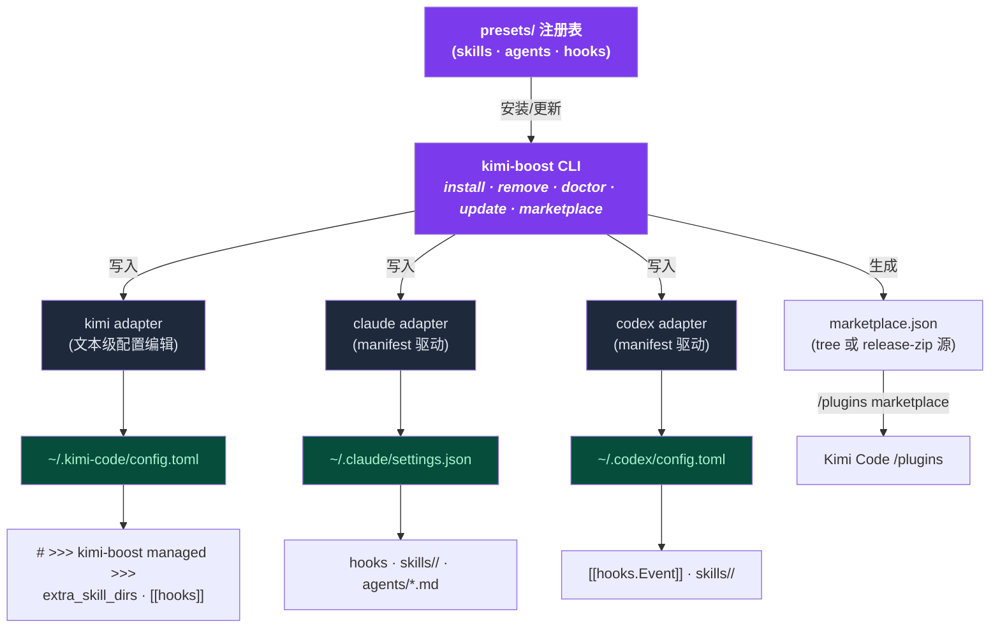

<div align="center">

# ⚡ kimi-boost

**久经实战的 **skills · hooks · agents**,一条命令装进 Kimi Code、Claude Code 和 Codex CLI。**

`npx kimi-boost install` → 选一个预设 → 完成。

[](https://github.com/shidesheng0218/kimi-boost)
[](https://www.npmjs.com/package/kimi-boost)
[](/LICENSE)
[](https://github.com/shidesheng0218/kimi-boost/actions)

</div>

---

## 为什么需要它

AI 编程助手只会做你教它的事。不加以引导,它会写出泛泛的代码、直接推 main 分支、对你还想保留的文件执行 `rm -rf`。手动配置 skills / hooks / agents 要花几个小时——大多数人永远不会去做。

**kimi-boost 几秒钟内把完整、有主张的开发工作流装进你的助手:**

| 你能得到 | 作用 |
|---|---|
| 🧠 **Skills** | 助手**自动加载**的最佳实践规则——无需每次提醒 |
| 🔍 **审查 Agent** | 提交前可以委派的只读 subagent |
| 🛡️ **Hooks** | 跨平台 Node 守卫:危险命令拦截、main 分支保护 |
| 🔄 **一键更新** | `kimi-boost update` 保持所有预设最新,支持 fork |

## 演示

<div align="center">


</div>

GIF 加载不出来(或 CDN 慢)?同一场演示的纯文本回放:

```text
$ kimi-boost install
✔ 选择一个预设:
    python — Python 工程化
  > vue3 — Vue 3 + TypeScript
    weapp — 微信小程序

✓ [kimi] 已安装预设 'vue3' 到 Kimi Code
  /Users/you/.kimi-boost/hooks/vue3
  config.toml[extra_skill_dirs], config.toml[extra_agent_dirs], config.toml[[hooks]] (+1)
  Run /reload or start a new session.

$ kimi-boost doctor
✓ kimi: detected (version 0.36.1)
✓ kimi: config.toml parses
✓ kimi: hook script valid
✓ kimi: mounted dir present
All checks passed.
```

## 快速开始

```bash
npx kimi-boost install
# ✔ vue3 — Vue 3 + TypeScript
# ✔ weapp — 微信小程序
# ✔ python — Python 工程化
```

交互式选择,结束。下一个会话立即生效。

> 需要 [Kimi Code](https://www.kimi.com/code/docs/kimi-code-cli/guides/getting-started.html)、Claude Code 或 Codex CLI。支持 macOS、Windows、Linux。

## 预设

| 预设 | 技术栈 | 审查 Agent | Hooks |
|---|---|---|---|
| `vue3` | Vue 3 + TypeScript | `vue3-reviewer` | 🛡️ main 分支保护 |
| `react` | React + TypeScript | `react-reviewer` | 🛡️ main 分支保护 |
| `nextjs` | Next.js(全栈) | `nextjs-reviewer` | 🛡️ main 分支保护 |
| `react-native` | React Native | `react-native-reviewer` | 🛡️ main 分支保护 |
| `flutter` | Flutter / Dart | `flutter-reviewer` | 🛡️ main 分支保护 |
| `uniapp` | uni-app(跨端) | `uniapp-reviewer` | 🛡️ main 分支保护 |
| `weapp` | 微信小程序 | `weapp-reviewer` | — |
| `nestjs` | NestJS / TypeScript 后端 | `nestjs-reviewer` | 🛡️ main 分支保护 |
| `express` | Express(Node.js) | `express-reviewer` | 🛡️ main 分支保护 |
| `fastapi` | FastAPI(Python) | `fastapi-reviewer` | 🛡️ main 分支保护 |
| `go` | Go | `go-reviewer` | 🛡️ main 分支保护 |
| `rust` | Rust | `rust-reviewer` | 🛡️ main 分支保护 |
| `java` | Java(Spring Boot) | `java-reviewer` | 🛡️ main 分支保护 |
| `python` | Python | `python-reviewer` | 🛡️ 危险命令拦截 |

> 每个预设都内置一份自动加载的 SKILL.md 最佳实践 + 一个审查 Agent。新技术栈由社区投票决定——[issue #1](https://github.com/shidesheng0218/kimi-boost/issues/1)。

每个预设就是本仓库里的**一个目录**——既是合法的 `kimi.plugin.json` 插件,也是 kimi-boost 预设。欢迎贡献:

```
presets/<id>/
├── preset.json          # kimi-boost 元数据
├── kimi.plugin.json     # Kimi Code 插件 manifest(原生 marketplace 形态)
├── skills/<name>/SKILL.md
├── agents/<name>-reviewer.md
└── hooks/<name>.mjs     # 跨平台 Node,fail-open 设计
```

## 命令

| 命令 | 作用 |
|---|---|
| `kimi-boost install [preset]` | 安装预设(`--dry-run` 预览,`--with-hooks` 强制 hooks) |
| `kimi-boost list` | 查看可用/已安装预设 |
| `kimi-boost remove <preset>` | 干净卸载 |
| `kimi-boost update [--repo owner/repo]` | 拉取最新版本并重新应用(支持 fork) |
| `kimi-boost doctor [--fix]` | 诊断配置语法/hooks/挂载目录/一致性 |
| `kimi-boost marketplace [--source-mode tree\|zip] [--tag vX.Y.Z]` | 生成 Kimi Code 自定义 marketplace JSON |
| `kimi-boost status` | 检测已安装 CLI 与平台 |

### `doctor` — 随时知道环境是否健康

```bash
$ kimi-boost doctor
✓ kimi: detected
  version 0.36.1
✓ kimi: config.toml parses
✓ kimi: hook script valid
  /Users/you/.kimi-boost/hooks/vue3/protect-main.mjs
✓ kimi: mounted dir present
⚠ codex: CLI not detected
  Install codex or ignore if you don't use it.

1 warning(s), no errors
```

`kimi-boost doctor --fix` 自动重建缺失的挂载目录与 hook 脚本。

## 同时也是插件市场

Kimi Code 自带原生插件系统(`/plugins`)。kimi-boost 同时充当它的**第三方 marketplace**:

```bash
kimi-boost marketplace
# 1. 终端执行: /plugins marketplace https://raw.githubusercontent.com/shidesheng0218/kimi-boost/main/marketplace.json
# 2. 环境变量: export KIMI_CODE_PLUGIN_MARKETPLACE_URL=<同一地址>
```

每个预设也可直接用 `/plugins install` 安装,manifest 中声明了 skills、agents、hooks 与 MCP servers。

## 工作原理



- **Kimi Code** — 以**文本级**方式编辑 `~/.kimi-code/config.toml`(managed `# >>> kimi-boost managed >>>` 区块 + 原位数组合并)。你的注释与格式原样保留。
- **Claude Code & Codex** — 基于 manifest 安装到 `~/.claude` / `~/.codex`;agent 文件遵循原生 frontmatter 格式(跨工具兼容)。
- **Hooks 是纯 Node `.mjs`** — 与 Kimi Code 官方文档示例一致,macOS / Windows / Linux 行为完全相同。

## 默认安全

- 🔒 **只动自己管理的片段**——注释、顺序、格式全部保留
- 🗄️ 每次修改前自动备份到 `<config>.kboost.bak`
- 🚧 受管目录白名单——拒绝删除 `~/.kimi-boost`、`~/.kimi-code`、`~/.claude`、`~/.codex` 之外的任何东西
- 🛡️ 双通道防护——已通过 Kimi `/plugins` 安装?不产生重复 hooks
- ⚡ Fail-open hooks——hook 崩溃永远不会阻塞你的工作(退出码 `0` 放行 · `2` 阻断)

## 路线图

- [ ] MCP server 预设
- [ ] token/成本用量守卫 hooks
- [ ] 项目级(`.kimi-boost/`)预设
- [ ] 更多技术栈预设(在 [issue #1](https://github.com/shidesheng0218/kimi-boost/issues/1) 投票)

## 贡献

预设目录由 PR 驱动:在 `presets/` 下新增目录,CI 自动校验 schema、hook 事件与文件存在性。见 [CONTRIBUTING.md](CONTRIBUTING.md)。

## 协议

MIT
